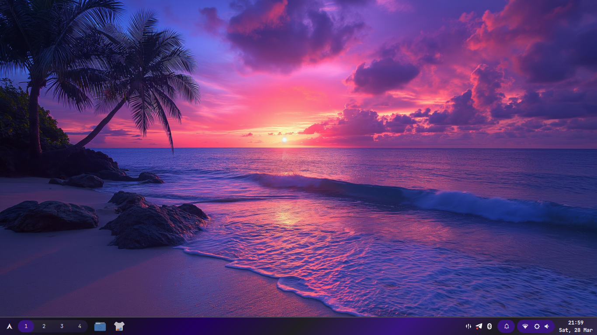
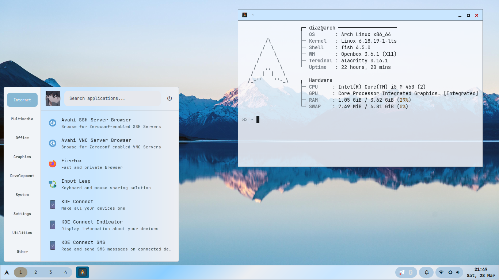
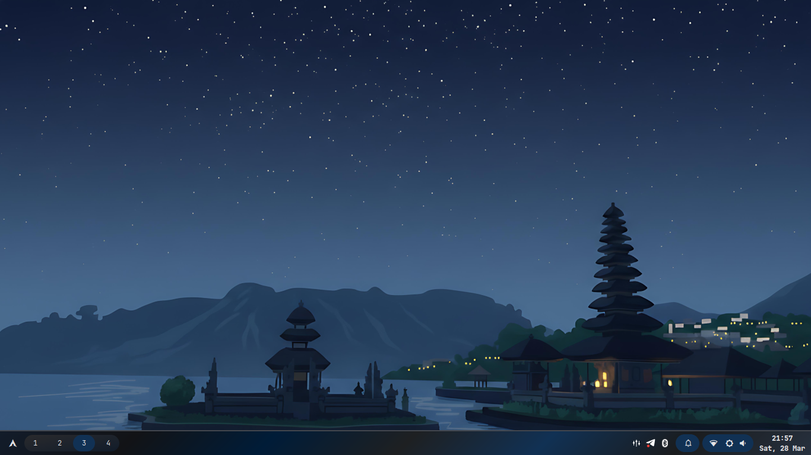
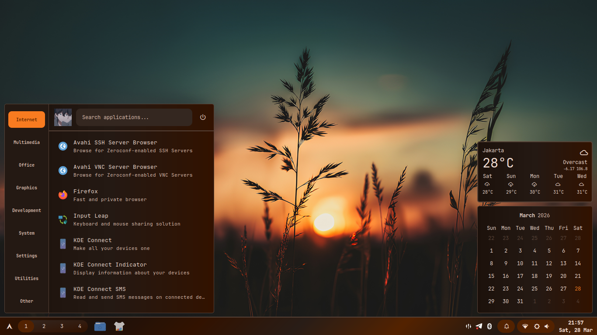

# Openbox Dynamic Theme

<div align="center">

**Minimal Openbox with automated Material 3 theming from wallpapers**

[](https://opensource.org/licenses/MIT)
[](https://archlinux.org/)
[](http://openbox.org/)

</div>

---

## Screenshots

**Clean Desktop**



**Busy Desktop**



**Minimalist Desktop**



**Daily Desktop**



---

## Features

- **Auto Material 3 Theming** - Colors extracted from wallpapers via m3wal
- **Lightweight** - Minimal resources, fast performance
- **Complete Setup** - Openbox, Eww, Alacritty, Fish, Rofi
- **One-Click Install** - Automated with backup

---

## Stack

| Component     | App          |
| :------------ | :----------- |
| WM            | Openbox      |
| Bar           | Eww          |
| Theming       | m3wal        |
| Compositor    | fastcompmgr  |
| Terminal      | Alacritty    |
| Shell         | Fish         |
| Launcher      | Rofi         |
| Notifications | Dunst        |

---

## Installation

```bash
git clone https://github.com/MDiaznf23/openbox-dynamic.git
cd openbox-dynamic
chmod +x install.sh
./install.sh
```

**Script will:**

- Install all packages (repos + AUR)
- Backup existing configs to `~/dotfiles_backup_YYYYMMDD_HHMMSS`
- Install yay if needed
- Install m3wal via AUR
- Copy all dotfiles
- Set Fish as default shell
- Apply initial theme

**Then:** Logout → Select Openbox → Login

---

## Usage

### Theming

**Change wallpaper:**

```bash
m3wal /path/to/wallpaper.jpg --full
```

**With options:**

```bash
m3wal wallpaper.jpg --full --mode dark --variant VIBRANT
m3wal wallpaper.jpg --full --mode light --variant EXPRESSIVE
m3wal wallpaper.jpg --full  # auto-detect (recommended)
```

**Variants:** `CONTENT` (default), `VIBRANT`, `EXPRESSIVE`, `NEUTRAL`, `TONALSPOT`, `FIDELITY`, `MONOCHROME`

**Modes:** `auto` (default), `light`, `dark`

---

## Configuration

### m3wal Config

`~/.config/m3-colors/m3-colors.conf`

```ini
[General]
mode = auto              # auto, light, dark
variant = CONTENT        # Color variant
operation_mode = full    # generator or full

[Features]
set_wallpaper = true
apply_xresources = true
generate_palette_preview = true
```

### Custom Templates

Create in `~/.config/m3-colors/templates/`:

```
# myapp.conf.template
background={{m3surface}}
foreground={{m3onSurface}}
primary={{m3primary}}
```

Deploy via `~/.config/m3-colors/deploy.json`:

```json
{
  "deployments": [
    { "source": "myapp.conf", "destination": "~/.config/myapp/colors.conf" }
  ]
}
```

### Hook Scripts

Create in `~/.config/m3-colors/hooks/`:

```bash
# Colors are available as environment variables
echo "Primary color: $M3_M3PRIMARY"
echo "Mode: $M3_MODE"
echo "Wallpaper: $M3_WALLPAPER"

# Reload applications
notify-send "Theme Updated" "Applied $M3_MODE mode"
openbox --reconfigure
```

Enable:

```ini
[Hook.Scripts]
enabled = true
scripts = reload-apps.sh
```

---

## File Structure

```
~/.config/
├── openbox/      # Window manager & autostart
├── eww/          # Bar & widgets
├── alacritty/    # Terminal
├── rofi/         # Launcher
├── dunst/        # Notifications
├── m3-colors/    # Theming
    ├── templates/     # Color templates
    ├── hooks/         # Scripts
    └── deploy.json    # Deployment

~/.local/share/themes/FlatColor/  # GTK theme
~/.themes/                        # Openbox themes
~/Pictures/Wallpapers/            # Your wallpapers
```

---

## Troubleshooting

**Fonts missing:**

```bash
fc-cache -fv
```

**Compositor not working:**

```bash
fastcompmgr -S -r 8 -o 0.6 -l -8 -t -8 -I 0.05 -O 0.05 &
```

**Manual wallpaper:**

```bash
feh --bg-scale /path/to/wallpaper.jpg
```

**Reconfigure Openbox:**

```bash
openbox --reconfigure
```

---

## Advanced

### Random Wallpaper

```bash
m3wal $(find ~/Pictures/Wallpapers -type f | shuf -n1) --full
```

### Python API

```python
from m3wal import M3WAL

m3 = M3WAL("wallpaper.jpg")
m3.analyze_wallpaper()
m3.generate_scheme(mode="dark", variant="VIBRANT")
m3.apply_all_templates()
m3.deploy_configs()
```

---

## Links

- [GitHub Issues](https://github.com/MDiaznf23/openbox-dynamic/issues)
- [m3wal](https://github.com/MDiaznf23/m3wal)
- [Arch Wiki - Openbox](https://wiki.archlinux.org/title/Openbox)

---

